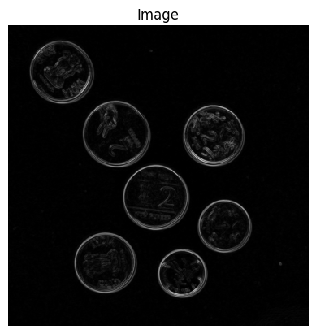

# VR_Assignment1_Nishad_MT2024102

# Computer Vision Assignment

This repository contains solutions to a computer vision assignment with two problems:

1. **Problem 1: Coin Detection and Segmentation** - Techniques to detect, segment, and count coins in an image
2. **Problem 2: Image Stitching for Panorama Creation** - Methods to stitch multiple overlapping images into a panorama

## Table of Contents
- [Dependencies](#dependencies)
- [Directory Structure](#directory-structure)
- [Problem 1: Coin Detection and Segmentation](#problem-1-coin-detection-and-segmentation)
  - [How to Run](#how-to-run-coin-detection)
  - [Methods Chosen](#methods-chosen-coin-detection)
  - [Results and Observations](#results-and-observations-coin-detection)
  - [Visual Outputs](#visual-outputs-coin-detection)
- [Problem 2: Image Stitching for Panorama](#problem-2-image-stitching-for-panorama)
  - [How to Run](#how-to-run-panorama)
  - [Methods Chosen](#methods-chosen-panorama)
  - [Results and Observations](#results-and-observations-panorama)
  - [Visual Outputs](#visual-outputs-panorama)
- [Limitations and Future Work](#limitations-and-future-work)

## Dependencies

- Python 3.x
- OpenCV (cv2)
- NumPy
- Matplotlib
- scikit-image
- Google Colab (for execution environment)

## Problem 1: Coin Detection and Segmentation

### How to Run Coin Detection

1. Upload the notebook `Coin_Detection_Segmentation.ipynb` to Google Colab
2. Upload your coin image (e.g., `coins2.jpg`) to the Colab environment or use the provided image in the `images/` folder
3. Update the path in the code if necessary: `filename = '/content/coins2.jpg'`
4. Execute all cells in the notebook sequentially

### Methods Chosen Coin Detection

#### 1. Image Preprocessing
The image is preprocessed using multiple Gaussian filters with different sigma values:
- `sigma=2` for edge detection: Moderate denoising is preferred for edge detection
- `sigma=3` for general denoising
- `sigma=25` for segmentation: This high sigma value creates a heavily blurred image that helps with segmentation by reducing noise and small details

```python
denoised_coins_for_edge_detection = gaussian(coins, sigma=2)
denoised_coins = gaussian(coins, sigma=3)
denoised_coins_for_segmentation = gaussian(coins, sigma=25)
```

#### 2. Edge Detection
Two different edge detection techniques are implemented and compared:

**Sobel Edge Detection**
```python
edge_sobel = sobel(gray_coins)
```

**Canny Edge Detection**
```python
canny_edge = canny(gray_coins_for_edge_detection, sigma=0.002)
```

#### 3. Segmentation
Binary segmentation is performed using thresholding:

```python
# Manual thresholding
binary_global = gray_coins > 0.65

# Otsu's method (automatic thresholding) - calculated but not used in final segmentation
thresh = threshold_otsu(gray_coins_for_segmentation)
```

#### 4. Contour Detection and Counting
Contours are detected from the binary image and filtered by size to identify individual coins:

```python
contours = measure.find_contours(binary_global, 0.8)
min_ring_size = 1200  # Minimum size threshold for coin contours
dots_contours = [cnt for cnt in contours if np.shape(cnt)[0] > min_ring_size]
```

### Results and Observations Coin Detection

- The preprocessing step with multiple Gaussian filters at different sigma values proved essential for effective edge detection and segmentation
- Canny edge detection provided more precise edges with better noise suppression compared to Sobel
- The manual threshold value (0.65) worked well for this particular image, creating clear binary separation of coins
- Contour filtering based on size (min_ring_size = 1200) successfully eliminated small noise contours
- The algorithm successfully detected and counted 7 coins in the image

### Visual Outputs Coin Detection

#### Original Image

*Figure 1: Original input image containing Indian coins of different denominations*

#### Edge Detection Results

*Figure 2: Sobel edge detection highlighting coin boundaries*


*Figure 3: Canny edge detection providing precise edges with better noise suppression*

#### Segmentation Results

*Figure 4: Binary thresholded image clearly separating coins from background*

#### Coin Detection and Counting

*Figure 5: The final result showing 7 detected coins with colored contours*

## Problem 2: Image Stitching for Panorama

### How to Run Panorama

1. Upload the notebook `Stitched_panorama.ipynb` to Google Colab
2. Upload your set of overlapping images (e.g., `balcony_1.jpg`, `balcony_2.jpg`, etc.) to the Colab environment or use the provided images in the `images/` folder
3. Update the image paths in the code if necessary:
   ```python
   image_paths = ['/content/balcony_1.jpg', '/content/balcony_2.jpg', '/content/balcony_3.jpg', '/content/balcony_4.jpg']
   ```
4. Execute all cells in the notebook sequentially

### Methods Chosen Panorama

#### 1. Feature Detection and Extraction
The SIFT (Scale-Invariant Feature Transform) algorithm is used for detecting and describing local features in the images:

```python
sift = cv2.SIFT_create()
kp1, des1 = sift.detectAndCompute(img1, None)
kp2, des2 = sift.detectAndCompute(img2, None)
```

#### 2. Feature Matching
FLANN (Fast Library for Approximate Nearest Neighbors) based matcher is used for efficient matching of features:

```python
FLANN_INDEX_KDTREE = 1
index_params = dict(algorithm=FLANN_INDEX_KDTREE, trees=5)
search_params = dict(checks=50)
flann = cv2.FlannBasedMatcher(index_params, search_params)
matches = flann.knnMatch(des1, des2, k=2)
```

#### 3. Match Filtering
Lowe's ratio test is applied to filter good matches:

```python
good_matches = []
for m, n in matches:
    if m.distance < 0.7 * n.distance:
        good_matches.append(m)
```

#### 4. Image Stitching
OpenCV's built-in Stitcher class is used for the actual stitching:

```python
stitcher = cv2.Stitcher_create()
status, panorama = stitcher.stitch(images)
```

### Results and Observations Panorama

- SIFT feature detection proved effective at finding distinct keypoints in the overlapping images
- The FLANN-based matcher with KD-tree algorithm efficiently matched features between images
- Lowe's ratio test with threshold 0.7 successfully filtered out most of the incorrect matches
- The stitching process successfully created a seamless panoramic view from 4 overlapping images
- The final panorama shows a wide cityscape view with good alignment between the original images

### Visual Outputs Panorama

#### Feature Detection

*Figure 6: Keypoints detected on the first image with green circles indicating scale*

#### Feature Matching

*Figure 7: Matching features between the first two images shown with connecting lines*

#### Final Panorama

*Figure 8: The final stitched panorama showing a seamless cityscape*

## Limitations and Future Work

The methods that we are using for coin detection are not intelligent, so the code will not be inherently robust. Depending on the image, we can tweak some parameters in the code such as sigma (for blurring), manual threshold values, and size of contours. By making these adjustments, the code will work for other images as well, assuming there is minimal noise in the background.

For the panorama stitching, the current implementation relies heavily on OpenCV's built-in `Stitcher_create()` rather than implementing the full stitching pipeline manually. Future work could include implementing:

1. Custom homography calculation using the matched keypoints
2. Perspective warping and image transformation
3. Custom blending techniques for smoother transitions
4. Exposure compensation to handle brightness differences between images
5. Handling for when stitching fails
